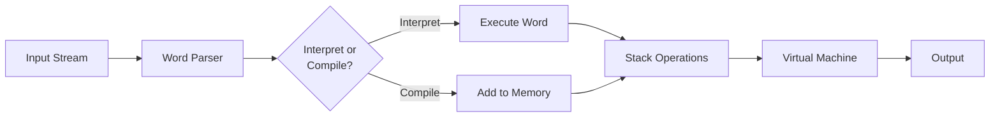

# Bashforth Low-Level Architecture - Version 1

## Overview

Bashforth is a complete Forth interpreter written entirely in bash. It implements a stack-based virtual machine that compiles and executes Forth source code. The implementation uses bash arrays and variables to emulate a classic Forth system with memory, stacks, and a dictionary.

## System Architecture



## Memory Model

Bashforth uses a linear memory array `m[]` to store:
- Compiled code (execution tokens and literals)
- Data (variables, constants)
- String data

### Memory Layout

```
0     [Dictionary Headers & Code Space]    [Variables & Data]    dp    [FREE]    dp+PADAWAY    [Scratch Pad]
      ^                                      ^                    ^                ^            ^
      start                                  data area            HERE             PAD
```

**Key Variables:**
- `dp` - Dictionary Pointer (points to next free address, also called HERE)
- `PADAWAY` - Distance between HERE and PAD (default 256)
- `m[]` - The actual memory array (associative array in bash)

### Global Arrays

| Array | Purpose | Example |
|-------|---------|---------|
| `m[]` | Main memory (code, data, strings) | m[100]=42 (store 42 at address 100) |
| `s[]` | Data stack values | s[1]=10 (first stack element) |
| `r[]` | Return stack values | r[1]=address (return address) |
| `h[]` | Word name headers | h[5]="dup" (name of 5th word) |
| `x[]` | Execution tokens/code field addresses | x[5]=1024 (code address for 5th word) |
| `hf[]` | Header flags (immediate bit, smudge bit) | hf[5]=1 (immediate word) |
| `ss[]` | String stack values | ss[1]="hello" |
| `asc[]` | ASCII table (character to code) | asc[65]="A" |

### Global Variables

```
Stack Pointers:
  sp      - Data stack pointer (index into s[])
  rp      - Return stack pointer (index into r[])
  ssp     - String stack pointer (index into ss[])
  s0, r0, ss0 - Stack origins (typically 0)

Virtual Machine:
  ip      - Instruction pointer (address in m[] of next word to execute)
  w       - Word pointer (current word being executed)
  tos     - Top of Stack (optimization: cached top data stack element)

Dictionary:
  wc      - Word count (total number of words defined)
  dp      - Dictionary pointer (next free memory address)
  lastxt  - Address of last word's execution token

State:
  state   - Compile/interpret mode flag (0=interpret, -1=compile)
  base    - Numeric radix (10 for decimal, 16 for hex, etc.)
  catchframe - Exception handling frame pointer

Other:
  temp    - Scratch variable
  LOADING - Status message during file loading
  sources - Directory for include files
```

## Stack Operations & Data Structures

### Data Stack

The data stack stores values in array `s[]` with pointer `sp`:

```
Before: s = [10, 20, 30, sp=2]
After "dup": s = [10, 20, 30, 30, sp=3]
```

**Standard Operations:**
- Push: `s[++sp]=$tos; tos=$newvalue`
- Pop: `result=$tos; tos=${s[sp--]}`
- Top cached in `tos` variable for performance

### Return Stack

Stores return addresses and loop parameters:

```
Return from word: ip=${r[rp--]}
Call word: r[++rp]=$ip; ip=$codeaddress
Loop parameter storage: r[rp] and r[rp-1]
```

### String Stack

Separate stack for string values:

```
Push string: ss[++ssp]="$stos"; stos="$newstring"
Pop string: stos="${ss[ssp--]}"
Underflow protection: if ((!ssp)) then throw -65
```

## Virtual Machine Execution

### The Main Loop

```bash
start() {
while w=${m[ip++]}; do
    ${m[w++]}  # Execute the word at address w
    w=${m[ip++]}
    ${m[w++]}
    ... (unrolled for performance - 16x unrolled loop)
done
}
```

This unrolled loop fetches 16 execution tokens in sequence for performance optimization.

### Word Structure

Every Forth word has:
1. **Name Field (NF)** - Stored in arrays `h[wc]` and `hf[wc]`
2. **Code Field Address (CFA)** - Stored in array `x[wc]`
3. **Data Field (DF)** - May follow CFA in memory at `m[cfa]`

### Execution Model

**Primitive Word (Bash Function):**
```bash
revealheader "dup"
code dup dup
dup() { s[++sp]=$tos; }
```
- Direct bash function execution
- Modifies stack directly
- Called via `${m[w++]}` in main loop

**High-Level Word (Compiled Forth):**
```bash
revealheader "nip"
code nip nip
nip() { ((sp--)); }
```
- Contains nested call to `nest` and `unnest`
- Compiled as sequence of execution tokens in memory

## Compilation Process

### State Machine

```
state=0 (Interpret):
  word found? -> Execute immediately
  number? -> Push to stack
  
state=-1 (Compile):
  word found? -> Compile execution token (unless immediate)
  number? -> Compile as literal
  immediate words? -> Execute anyway
```

### Dictionary Building

When a new word is defined:
1. Create header: `revealheader "name"` → Add to `h[wc]`, `hf[wc]`, `x[wc]`
2. Compile body: `compile ...` → Add tokens/data to `m[dp]`
3. Reveal: `reveal` → Set smudge bit to make visible

### Key Variables in Compilation

- `wc` - Word count (total words, index for next word)
- `dp` - Dictionary pointer (next free memory address)
- `state` - Compile/interpret flag
- `lastxt` - Pointer to last word's execution token field

## Word Categories

### Primitives (Bash Functions)
- Direct bash function implementations
- Fast execution
- Examples: `+`, `-`, `dup`, `drop`, `@`, `!`

### High-Level Words (Compiled Forth)
- Compiled as sequences of other words
- Begin with `nest`, end with `unnest`
- Can reference other words

### Immediate Words
- Execute during compilation phase
- Used for control structures, comments
- Flag set in `hf[wc] & precedencebit`
- Examples: `;`, `if`, `do`, `"` (various quote words)

### Deferred Words
- Indirect execution via execution token
- Used for exception handling and system vectors
- Execute: `ip=$w`

## Control Structures

### Branch Instructions

```bash
# Unconditional branch
branch() { ((ip+=m[ip])); }

# Conditional branch (0branch)
branch0() {
   if ((tos)); then ((ip++)); else ((ip+=m[ip])); fi
   tos=${s[sp--]}
}
```

Branches are compiled as offsets in the instruction stream.

### Loop Implementation

```bash
dodo() {      # ( limit start -- )
   r[++rp]=${s[sp--]}   # limit
   r[++rp]=$tos         # start
   ((ip++))
   tos=${s[sp--]}
}

doloop() {
   ((r[rp]++))
   if ((r[rp] - r[rp-1])); then
      ((ip += m[ip]))   # branch back
   else
      ((ip++, rp -= 2))  # exit loop
   fi
}
```

Loop index in `r[rp]`, limit in `r[rp-1]`.

## Exception Handling

### Catch/Throw Mechanism

```bash
catch() {
   r[++rp]=$ip              # save return address
   r[++rp]=$sp              # save stack pointer
   r[++rp]=$catchframe      # save outer frame
   catchframe=$rp           # new frame
   r[++rp]=$brthrow0        # target handler
   execute                  # execute protected code
}

throw() {
   if ((tos)); then          # if error code non-zero
      if ((catchframe)); then # if in catch
         restore state from frame
      else                     # top-level
         exception handler
      fi
   fi
}
```

Catches are chained via `catchframe` linked list in return stack.

## String Stack & String Operations

Separate from data stack for string handling:

```bash
pushstr() {   # ( a n -- )
   pack      # convert memory to string
   ss[++ssp]="$stos"
   stos="$tos"
   tos="${s[sp--]}"
}

pack() {      # ( a n -- string )
   for ((i=tos; i; i--)); do
      tos+="${asc[m[temp++]]}"  # build string char by char
   done
}
```

## Memory Access Words

### Fetch Operations
```bash
fetch() { tos="${m[tos]}"; }        # @ (fetch cell)
cfetch() { ((tos=m[tos]&255)); }    # c@ (fetch byte)
```

### Store Operations
```bash
store() {                            # !
   m[tos]=${s[sp--]}
   tos=${s[sp--]}
}

cstore() {                           # c!
   ((m[tos]=s[sp--]&255))
   tos=${s[sp--]}
}
```

## Input/Output System

### Parser - WORD and STREAM

```bash
stream() {      # ( delimiter -- a n )
   # Skip leading delimiters
   # Read characters until delimiter or end
   # Return address and length
}

word() {        # ( delimiter -- cstring )
   # Uses STREAM
   # Returns counted string at HERE
```

### Output - EMIT and TYPE

```bash
emit() {                        # ( c -- )
   printf '%s' "${asc[tos]}"   # Output ASCII character
   tos="${s[sp--]}"
}

type() {                        # ( a n -- )
   pack                        # Convert memory to string
   printf '%s' "$tos"          # Output string
   tos="${s[sp--]}"
}
```

## System Bootstrap

The interpreter starts with:
1. Initialize arrays and variables
2. Define all primitives
3. Define high-level words
4. Remove transient functions
5. Execute `cold` startup sequence

Key entry points:
- `boot` - Cold start address
- `cold` - Full initialization
- `warm` - Reinitialize and restart interpreter
- `quit` - Main command loop

## Header Structure and Flags

Header flags stored in `hf[wc]`:
- Bit 0 (`precedencebit=1`) - Immediate word flag
- Bit 1 (`smudgebit=2`) - Smudge bit (hide/reveal)

Creation of word `foo`:
```
h[wc]="foo"              # Name
x[wc]=$codeaddress      # Code field address
hf[wc]=0                # Flags (0=not immediate)
wc++                    # Increment word count
reveal                  # Set smudge bit
```

## Performance Optimizations

1. **TOS Caching** - Top of stack cached in `tos` variable
2. **Unrolled Main Loop** - 16x instruction unrolling
3. **Function Inlining** - Primitives as bash functions
4. **Compiled Words** - Pre-compiled sequences of tokens
5. **Bit Operations** - Use bash arithmetic for speed

## Error Handling

Standard exception codes (negated):
- `-1` Terminated
- `-2` Aborted
- `-4` Stack underflow
- `-10` Division by zero
- `-13` Word not found
- `-14` Compile-only word in interpret mode
- `-38` File not found
- `-65` String stack underflow

Thrown via `codethrow()` which either:
- Restores catch frame and resumes
- Calls exception handler for top-level
