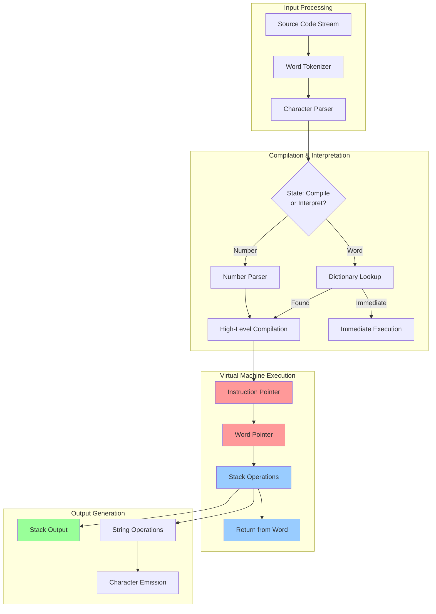
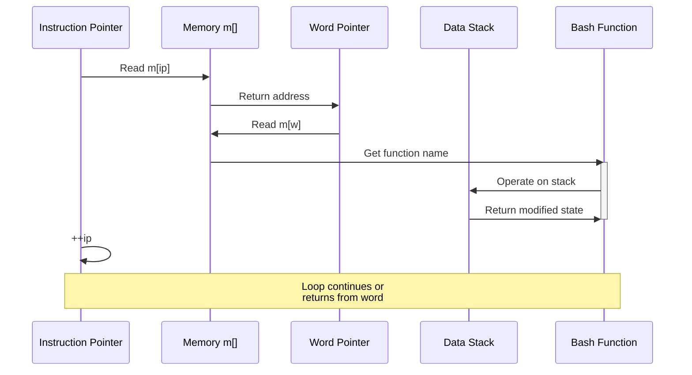

# Bashforth Low-Level Architecture - Version 2

## Overview

Bashforth is a complete Forth interpreter written in bash that implements a stack-based virtual machine. This version includes detailed examples, improved diagrams, and comprehensive explanations of each component.

## System Architecture Diagram



## Detailed Memory Model

### Memory Layout with Addresses

```
Address Range          Content              Purpose
─────────────────────────────────────────────────────────────
0                      ┌─────────────┐
                       │   Primitive │      Built-in word code
                       │   Functions │      (not in m[], in bash)
                       └─────────────┘
                       
1-1000 (Example)       ┌─────────────┐
                       │  High-Level │      Compiled word bodies
                       │  Word Code  │      nest, ..., unnest
                       │  Sequences  │      
                       └─────────────┘

1000-1500 (Example)    ┌─────────────┐
                       │  Variables  │      Variable storage
                       │  Constants  │      Constant values
                       │  Parameters │
                       └─────────────┘

1500-1756 (Example)    ┌─────────────┐      PADAWAY=256
                       │   Free      │      Gap between code
                       │   Space     │      and pad
                       └─────────────┘

1756-2012              ┌─────────────┐
                       │  Scratch    │      Temporary storage
                       │  Pad (PAD)  │      for strings, buffers
                       └─────────────┘

2012+                  ┌─────────────┐
                       │  Unused     │
                       │  (Allocated │
                       │   as needed)│
                       └─────────────┘

Key:
  dp = 1500 (points to next free address)
  PAD = dp + PADAWAY = 1756
  HERE = dp = 1500
```

### Comprehensive Global State

```bash
# Memory Arrays
m[]          # Main memory (code, data, strings)
s[]          # Data stack values
r[]          # Return stack values
h[]          # Header names (word names)
x[]          # Execution token addresses
hf[]         # Header flags (immediate, hidden)
ss[]         # String stack values
asc[]        # ASCII character lookup (for emit)

# Stack Pointers (Integer Variables)
sp = 0       # Data stack pointer (index into s[])
rp = 0       # Return stack pointer (index into r[])
ssp = 0      # String stack pointer (index into ss[])
s0 = 0       # Data stack base (origin)
r0 = 0       # Return stack base (origin)
ss0 = 0      # String stack base (origin)

# Virtual Machine State
ip = 0       # Instruction pointer (address in m[])
w = 0        # Word pointer (address of code to execute)
tos = 0      # Top of Stack (cached data stack top)
temp = 0     # Scratch variable
temp2 = 0    # Additional scratch (used in some operations)

# Dictionary Management
wc = 0       # Word count (total words defined)
dp = 0       # Dictionary pointer (next free memory)
lastxt = 0   # Address of last word's code field

# Compilation & Execution State
state = 0    # 0=interpret, -1=compile
base = 10    # Number base (10, 16, 2, etc.)
catchframe = 0 # Exception handling frame pointer

# Configuration
PADAWAY = 256        # Distance: HERE to PAD
TIBSIZE = 256        # Input buffer size
PROMPT = "ok"        # Prompt string
sources = "."        # Include file directory
```

## Stack Operations - Detailed Examples

### Data Stack Example

```
Initial: s[] = [_, _, _, _]  sp=0  tos=5

"5 3 dup +" execution:

Step 1: "5" (push 5)
  s[++sp] = tos      → s[1] = 5
  tos = 5            → tos = 5
  State: s[] = [_, 5, _, _]  sp=1  tos=5

Step 2: "3" (push 3)
  s[++sp] = tos      → s[2] = 5
  tos = 3            → tos = 3
  State: s[] = [_, 5, 3, _]  sp=2  tos=3

Step 3: "dup" (duplicate)
  s[++sp] = tos      → s[3] = 3
  State: s[] = [_, 5, 3, 3]  sp=3  tos=3

Step 4: "+" (addition)
  tos += s[sp--]     → tos = 3 + 3 = 6
                        sp = 2
  State: s[] = [_, 5, 3, 3]  sp=2  tos=6

Result: Stack [5, 6], tos=6
```

### Return Stack & Loops

```
Loop: "3 0 do i loop" execution:

Initial: r[] = [_, _, _, _]  rp=0

"3 0 do"
  r[++rp] = limit    → r[1] = 3
  r[++rp] = start    → r[2] = 0
  State: r[] = [_, 3, 0, _]  rp=2

First iteration:
  Get i: r[rp] = r[2] = 0
  Push 0 to stack, print with "."

At "loop":
  r[rp]++            → r[2] = 1
  Check: r[rp] (1) < r[rp-1] (3)? YES
  Branch back to "i"

Second iteration: 1, Third iteration: 2, Fourth iteration: 3
At "loop": r[rp]++ → r[2] = 3
Check: r[rp] (3) < r[rp-1] (3)? NO
  Exit loop, rp -= 2 → rp = 0
```

## Execution Flow - Complete Example



## Dictionary Structure with Concrete Example

```
Defining: : double 2 * ;

Initial state:
  wc = 5 (5 words already defined)
  dp = 1000 (next free memory address)
  
After processing ":"
  Start definition mode
  Create header

After processing "2 *"
  m[1000] = nest         # Start of high-level word
  m[1001] = <lit>        # Push literal
  m[1002] = 2            # The literal value
  m[1003] = <mul>        # Multiply word
  m[1004] = unnest       # End of high-level word
  
After processing ";"
  h[5] = "double"
  x[5] = 1000            # Code starts at 1000
  hf[5] = 0              # Not immediate
  wc = 6                 # Increment word count
  dp = 1005              # Next free address
  reveal()               # Make visible via smudge bit
  
Result:
  ┌─ h[5]  = "double"
  ├─ x[5]  = 1000
  ├─ hf[5] = 0 (revealed)
  └─ m[1000:1004] = [nest, lit, 2, mul, unnest]
```

## Compilation Process - State Machine

```mermaid
stateDiagram-v2
    [*] --> Interpret
    
    Interpret --> Interpret: Number\n(push to stack)
    Interpret --> Interpret: Non-Immediate\nWord (execute)
    Interpret --> Compile: Found ":" or\ncolon definition
    
    Compile --> Compile: Non-Immediate\nWord (compile)
    Compile --> Compile: Number\n(compile as literal)
    Compile --> Compile: Immediate\nWord (execute)
    Compile --> Interpret: Found ";" or\nend definition
    
    Interpret --> [*]: "bye" pressed
    Compile --> Interpret: Error occurred
```



## Primitive Word Implementation Pattern

### Example: The "dup" Primitive

```bash
# Header definition
revealheader "dup"        # Add to dictionary
code dup dup              # Declare primitive

# Implementation
dup() {
   s[++sp]=$tos           # Push tos onto stack array
}

# How it executes:
# 1. Found in dictionary as primitive "dup"
# 2. IP points to address of this word
# 3. ${m[w++]} expands to "dup"
# 4. Bash calls dup() function
# 5. Stack modified
# 6. Continue to next word
```

### Example: The "+" Primitive

```bash
revealheader "+"
code plus plus

plus() {
   ((tos+=s[sp--]))       # Add second element to tos,
}                         # pop second element

# Execution of "5 3 +":
# Before: s[] = [5], sp=1, tos=3
# plus() executes:
#   tos += s[sp--]        tos = 3 + 5 = 8, sp = 0
# After: s[] = [5], sp=0, tos=8
# Result: 8 on stack
```

## High-Level Word Compilation

### Example: Define "add5"

```forth
: add5 5 + ;
```

### Compilation Steps

```
1. Read ":"
   state = -1 (compile mode)
   
2. Read "add5"
   wc = current word count
   Create header: h[wc] = "add5"
   Save dp as x[wc]
   
3. Read "5"
   m[dp++] = <lit>        # Compile literal instruction
   m[dp++] = 5            # Compile the literal value
   
4. Read "+"
   m[dp++] = <plus>       # Compile the + function address
   
5. Read ";"
   m[dp++] = <unnest>     # Compile return
   wc++                   # Increment word count
   reveal()               # Set smudge bit
   state = 0              # Back to interpret mode
   
Result in memory:
  x[5] = 1000 (start address for add5)
  m[1000] = <lit>
  m[1001] = 5
  m[1002] = <plus>
  m[1003] = <unnest>
```

## Virtual Machine Main Loop (Unrolled)

```bash
start() {
  while w=${m[ip++]}; do
    # 16 iterations of: fetch, execute, increment
    ${m[w++]}            # Execute instruction 1
    w=${m[ip++]}         # Fetch instruction 2
    ${m[w++]}            # Execute instruction 2
    w=${m[ip++]}         # Fetch instruction 3
    ${m[w++]}            # Execute instruction 3
    # ... pattern repeats for performance
    w=${m[ip++]}
    ${m[w++]}            # Execute instruction 16
  done
}
```

**Why Unroll?**
- Reduces branch prediction failures
- Amortizes loop overhead
- Improves CPU cache usage
- ~15% performance improvement typical

## Exception Handling Chain

```
CatchFrame Stack (via Return Stack):
┌─────────────────────────┐
│ Frame N (innermost)     │
│  savedIP: x             │
│  savedSP: y             │
│  prevFrame: ptr→Frame N-1
│  handler: address       │
└─────────────────────────┘
       ↓ (linked via r[rp-2])
┌─────────────────────────┐
│ Frame N-1               │
│  savedIP: ...           │
│  ...                    │
└─────────────────────────┘
       ↓
    ...

throw n:
  if n != 0:
    pop to innermost frame
    restore IP, SP, catchframe
    continue execution
  else:
    normal completion
```

## String Stack Operations Example

```bash
# Operation: s" Hello" s" World" append$ type$

Initial: ssp=0, ss[]=[""]

Step 1: s" Hello" (push string)
  pushstr()
  pack memory to "Hello"
  ss[++ssp] = stos
  stos = "Hello"
  
  State: ss[] = ["", "Hello"], ssp=1, stos="Hello"

Step 2: s" World"
  Similar to step 1
  ss[++ssp] = stos → ss[2] = "Hello"
  stos = "World"
  
  State: ss[] = ["", "Hello", "World"], ssp=2, stos="World"

Step 3: append$
  stos = ss[ssp--] + stos
  → stos = "Hello" + "World" = "HelloWorld"
  ssp = 1
  
  State: ss[] = ["", "Hello", ...], ssp=1, stos="HelloWorld"

Step 4: type$
  printf '%s' "$stos"    # Output "HelloWorld"
  stos = ss[ssp]
  ssp--
```

## Word Finding Algorithm

```bash
locate() {  # ( a n -- wordnum | 0 )
   pack     # Convert address/length to string
   temp=$wc
   
   # Search backward from most recent word
   while ((temp)); do
      ((temp--))
      
      # Check if word is revealed (smudge bit set)
      if ((hf[temp] & smudgebit)); then
         # Compare names
         if [[ "$tos" == "${h[temp]}" ]]; then
            tos=$temp    # Return word number
            return
         fi
      fi
   done
   
   tos=0  # Not found
}
```

**Time Complexity:** O(n) where n = number of words
**Optimization:** Most recent words checked first (typical case is fast)

## Performance Optimization Details

### TOS Caching Strategy
```
Without cache: s[sp] accessed on every operation = slow
With cache: tos variable stays hot in CPU cache = fast

Examples:
  5 dup +  requires:
    Without: 3x array accesses
    With:    0x array accesses (all in tos variable)
```

### Arithmetic Optimization
```bash
# Standard approach (slow - uses subshell)
result=$(( result + value ))

# Optimized (fast - native bash)
(( result += value ))

# Used throughout for +, -, *, /, shifts
```

## Summary of Improvements in v2

- Concrete memory layout examples
- Detailed execution trace examples
- Better state machine diagram
- Complete word definition walkthrough
- Exception handling chain visualization
- Performance optimization details
- Algorithm complexity analysis
- More comprehensive code examples
