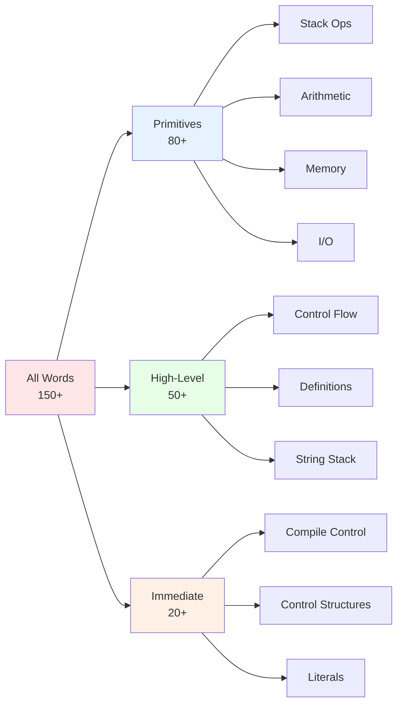

# Bashforth Forth Implementation Specification - Version 2

## Overview

Detailed specification of ~150+ words implemented in Bashforth, organized by category with comprehensive examples, stack effects, and implementation notes.

## Word Categories Overview



## Category 1: Stack Manipulation Words

### Core Stack Operations (13 words)

```forth
dup     ( x -- x x )              Duplicate top
drop    ( x -- )                  Discard top
swap    ( x1 x2 -- x2 x1 )        Exchange top two
over    ( x1 x2 -- x1 x2 x1 )     Copy second to top
rot     ( x1 x2 x3 -- x2 x3 x1 )  Rotate third to top
-rot    ( x1 x2 x3 -- x3 x1 x2 )  Rotate top under second
nip     ( x1 x2 -- x2 )           Discard second
tuck    ( x1 x2 -- x2 x1 x2 )     Copy top under second
pick    ( ...xn x0 n -- xn )      Copy nth to top (0-based)
roll    ( ...xn x0 n -- x0 xn )   Move nth to top
?dup    ( 0 -- 0 ) or ( x -- x x ) Duplicate if nonzero
depth   ( -- n )                  Count stack items
```

**Example Sequences:**

```forth
// Copy third element to top: a b c pick(2)
3 1 5 2 pick
.s  ( should show: 3 1 5 3 )

// Rotate elements: a b c -> b c a
: rot-test 1 2 3 rot ;
rot-test .s  ( should show: 2 3 1 )
```

### Double-Cell Stack Operations (3 words)

```forth
2dup    ( x1 x2 -- x1 x2 x1 x2 )  Duplicate two
2drop   ( x1 x2 -- )              Drop two
2swap   ( x1 x2 x3 x4 -- x3 x4 x1 x2 ) Swap pairs
```

## Category 2: Return Stack Operations

### Return Stack Manipulation (8 words)

```forth
>r      ( x -- ) R: ( -- x )      Move to return stack
r>      ( -- x ) R: ( x -- )      Move from return stack
r@      ( -- x ) R: ( x -- x )    Copy from return stack
rdrop   ( -- ) R: ( x -- )        Drop return stack top
2>r     ( x1 x2 -- ) R: ( -- x2 x1 ) Move pair to return stack
2r>     ( -- x1 x2 ) R: ( x2 x1 -- ) Move pair from return stack
i       ( -- x )                  Current loop index (>r equivalent)
j       ( -- x )                  Outer loop index
```

**Practical Example:**

```forth
: save-under-doublequote ( a b -- a b )
  2>r                    ( -- ) R: ( b a )
  ." Processing..."
  2r>                    ( -- a b ) R: ( -- )
;
```

## Category 3: Arithmetic and Bitwise Operations

### Basic Arithmetic (15 words)

```forth
+       ( n1 n2 -- n3 )           Add
-       ( n1 n2 -- n3 )           Subtract (n1-n2)
*       ( n1 n2 -- n3 )           Multiply
/       ( n1 n2 -- n3 )           Divide
/mod    ( n1 n2 -- r q )          Remainder and quotient
mod     ( n1 n2 -- r )            Remainder only
*/mod   ( n1 n2 n3 -- r q )       (n1*n2)/n3 with remainder
*/      ( n1 n2 n3 -- q )         (n1*n2)/n3 quotient only
**      ( n1 u -- n2 )            Power (n1**u)
abs     ( n -- u )                Absolute value
negate  ( n1 -- n2 )              Negate
min     ( n1 n2 -- min )          Minimum
max     ( n1 n2 -- max )          Maximum
1+      ( n1 -- n2 )              Add 1
1-      ( n1 -- n2 )              Subtract 1
```

**Calculation Examples:**

```forth
// Factorial-like: 5 * 4 * 3
5 4 * 3 * .  ( outputs: 60 )

// Using */mod for scaling: (100 * 3) / 7
100 3 7 */mod .s  ( outputs remainder quotient )

// Power: 2^10
2 10 ** .  ( outputs: 1024 )
```

### Shift and Bitwise (7 words)

```forth
2*      ( n1 -- n2 )              Multiply by 2 (shift left)
2/      ( n1 -- n2 )              Divide by 2 (shift right)
cell+   ( a -- a )                Same as 1+ (address arithmetic)
lshift  ( n1 n2 -- n3 )           Logical shift left
rshift  ( n1 n2 -- n3 )           Logical shift right (sign-extending)
and     ( x1 x2 -- x3 )           Bitwise AND
or      ( x1 x2 -- x3 )           Bitwise OR
xor     ( x1 x2 -- x3 )           Bitwise XOR
invert  ( x -- x' )               Bitwise NOT (invert all bits)
```

**Bitwise Examples:**

```forth
// Bit manipulation: set bit 3 in number
15 1 3 lshift or .  ( 15 | (1<<3) = 15 | 8 = 23 )

// Mask: get lower 8 bits
256 255 and .  ( 256 & 255 = 0 )

// XOR swap technique
: xor-swap ( x1 x2 -- x2 x1 )
  xor 2dup xor >r xor r>
;
```

## Category 4: Comparison and Testing

### Comparison Operations (7 words)

```forth
=       ( x1 x2 -- f )            Equal (true=-1, false=0)
<>      ( x1 x2 -- f )            Not equal
<       ( n1 n2 -- f )            Less than (n1 < n2)
>       ( n1 n2 -- f )            Greater than (n1 > n2)
0=      ( x -- f )                Equal to zero
0<      ( n -- f )                Less than zero (negative?)
d=      ( xl xh yl yh -- f )      Double-cell equal
```

**Testing Examples:**

```forth
: in-range? ( n low high -- f )
  >r over > over < or not
  r> ;

5 1 10 in-range? .  ( outputs: -1 for true )

: max-of-three ( a b c -- max )
  2dup > if drop else nip then
;

5 3 8 max-of-three .  ( outputs: 8 )
```

## Category 5: Memory Access

### Single-Cell Memory (5 words)

```forth
@       ( a -- x )                Fetch cell
!       ( x a -- )                Store cell
+!      ( n a -- )                Add to memory location
exchange( x a -- x' )             Fetch and store atomically
c@      ( a -- c )                Fetch byte (8-bit)
c!      ( c a -- )                Store byte
```

### Multi-Cell Memory (4 words)

```forth
2@      ( a -- x1 x2 )            Fetch two cells
2!      ( x1 x2 a -- )            Store two cells
count   ( a -- a+1 c )            Fetch byte and increment
skim    ( a -- a+1 x )            Fetch cell and increment
```

**Memory Examples:**

```forth
variable my-var
42 my-var !
my-var @ .  ( outputs: 42 )

: increment-var ( addr -- )
  dup @ 1+ swap !
;

my-var increment-var
my-var @ .  ( outputs: 43 )

// Using 2@ and 2!
variable pair
10 20 pair 2!
pair 2@ .s  ( outputs: 10 20 )
```

### Block Operations (4 words)

```forth
fill    ( a n c -- )              Fill n cells at a with c
move    ( a1 a2 n -- )            Move n cells from a1 to a2
compare ( a1 n1 a2 n2 -- -1|0|1 ) Compare strings
scan    ( a n c -- n' )           Find character
skip    ( a n c -- n' )           Skip leading chars
```

**Example:**

```forth
: zero-range ( addr count -- )
  0 fill
;

: copy-string ( src dst len -- )
  move
;

// Clear 100 cells starting at address 1000
1000 100 zero-range
```

## Category 6: Input/Output

### Character and String I/O (8 words)

```forth
emit    ( c -- )                  Output character (ASCII)
space   ( -- )                    Output space
spaces  ( n -- )                  Output n spaces
cr      ( -- )                    Output newline
type    ( a n -- )                Output string of n chars
key     ( -- c )                  Read character
key?    ( -- f )                  Check key available
accept  ( a n -- n' )             Read up to n chars
```

**I/O Examples:**

```forth
: say-hello
  ." Hello, " key key drop
  ." Goodbye" cr
;

: print-range ( n -- )
  0 do
    i . space
  loop
;

10 print-range  ( outputs: 0 1 2 3 4 5 6 7 8 9 )
```

### Number Output (3 words)

```forth
.       ( n -- )                  Print number (respects base)
..      ( n -- )                  Print number (raw, debug)
.s      ( -- )                    Display stack contents
```

### Number Base Control (3 words)

```forth
hex     ( -- )                    Set base to 16
decimal ( -- )                    Set base to 10
binary  ( -- )                    Set base to 2
```

**Base Example:**

```forth
42 .            ( outputs: 42 in decimal )
hex 42 .        ( outputs: 2a in hex )
binary 42 .     ( outputs: 101010 in binary )
decimal         ( back to decimal mode )
```

## Category 7: Control Structures

### Conditionals (3 words - all immediate)

```forth
if      ( f -- )                  Start conditional
else    ( -- )                    Alternative branch
then    ( -- )                    End conditional
```

**If Examples:**

```forth
: sign ( n -- )
  dup 0< if
    ." negative"
  else
    dup 0= if
      ." zero"
    else
      ." positive"
    then
  then
;

-5 sign  ( outputs: negative )
```

### Loops (7 words - all immediate)

```forth
begin   ( -- )                    Start loop
until   ( f -- )                  Loop until true
while   ( f -- )                  Loop while true
repeat  ( -- )                    End while loop
again   ( -- )                    Unconditional loop
do      ( limit start -- )        Start indexed loop
?do     ( limit start -- )        Conditional loop
loop    ( -- )                    Increment and repeat
+loop   ( n -- )                  Add to counter and repeat
leave   ( -- )                    Exit loop
?leave  ( f -- )                  Exit if true
for     ( n -- )                  Start countdown loop
next    ( -- )                    End countdown loop
```

**Loop Examples:**

```forth
// Begin...until
: countdown ( n -- )
  begin
    dup . 1-
    dup 0= until
  drop
;

5 countdown  ( outputs: 5 4 3 2 1 0 )

// Do...loop
: times-table ( n -- )
  10 0 do
    i . space
    i . * space cr
  loop
;

7 times-table  ( prints 7x table from 0-9 )

// +loop (custom increment)
: every-other ( n -- )
  n 0 do
    i .
  2 +loop
;
```

## Category 8: Word Definition and Compilation

### Basic Definition (3 words - immediate except :)

```forth
:       ( <name> -- )             Start colon definition
:noname ( -- a )                  Define unnamed word
;       ( -- )                    End definition (immediate)
```

**Definition Examples:**

```forth
: double 2 * ;
: triple 3 * ;
: square dup * ;
: cube dup dup * * ;

5 double .  ( outputs: 10 )
5 cube .    ( outputs: 125 )

: my-comp
  [ 1 2 + ] literal  ( compiles 3 as literal )
;
```

### Compilation Control (3 words - immediate)

```forth
[       ( -- )                    Turn off compilation
]       ( -- )                    Turn on compilation
literal ( n -- )                  Compile as literal (immediate)
```

### Advanced Definition (5 words)

```forth
create  ( <name> -- )             Create with runtime action
variable( <name> -- )             Create variable
constant( <name> x -- )           Create constant
immediate( -- )                   Make word immediate
does>   ( -- )                    Define runtime action
```

**Examples:**

```forth
variable counter
100 counter !
counter @ .  ( outputs: 100 )

42 constant answer
answer .  ( outputs: 42 )

: 2variable create 0 , 0 , ;
: 2constant create , , does> 2@ ;
```

## Category 9: String Stack Operations

### String Stack (18 words)

```forth
push$   ( a n -- )                Push string to stack
pop$    ( -- a n )                Pop string to memory
type$   ( -- )                    Print and discard top
dup$    ( -- )                    Duplicate top string
drop$   ( -- )                    Discard top string
swap$   ( -- )                    Swap top two strings
over$   ( -- )                    Copy second string to top
nip$    ( -- )                    Discard second string
rot$    ( -- )                    Rotate three strings
2dup$   ( -- )                    Duplicate two strings
append$ ( -- )                    Concatenate two strings
sub$    ( u1 u2 -- )              Extract substring
left$   ( u -- )                  Keep left u chars
right$  ( u -- )                  Keep right u chars
depth$  ( -- n )                  Count string stack items
.s$     ( -- )                    Display string stack
```

**String Examples:**

```forth
s" Hello" push$
s" World" push$
append$
type$  ( outputs: HelloWorld )

: greet-user ( -- )
  s" What is your name? " type
  s" Thank you!" push$
  type$
;
```

## Category 10: Dictionary and Introspection

### Word Finding (6 words)

```forth
'       ( <name> -- xt )          Get execution token
[']     ( <name> -- )             Compile execution token
locate  ( a n -- n|0 )            Find word by name
find    ( a n -- xt f | a n 0 )   Dictionary search
words   ( -- )                    List all words
doc     ( <name> -- )             Show documentation
see     ( <name> -- )             Show source code
```

### Word Manipulation (6 words)

```forth
>body   ( xt -- a )               Get body address
body>   ( a -- xt )               Get code address
>name   ( xt -- n )               Get word number
name>   ( n -- xt )               Get execution token
name    ( n -- a n )              Get word name
.name   ( n -- )                  Print word name
```

## Category 11: Exception Handling

### Exception Mechanism (3 words)

```forth
catch   ( xt -- n )               Catch exceptions
throw   ( n -- )                  Throw exception
abort   ( -- )                    Throw -2
```

**Exception Example:**

```forth
: safe-divide ( a b -- result|error )
  ['] / catch
  ?dup if
    ." Division error" cr
    0
  then
;
```

## Comprehensive Word Classification

| Class | Count | Examples |
|-------|-------|----------|
| Primitives | 80+ | +, -, dup, @, ! |
| High-Level | 50+ | double, factorial, looping |
| Immediate | 20+ | if, do, :, literal |
| String Stack | 18 | push$, append$, type$ |
| I/O | 15 | emit, type, key, . |
| Control | 15 | if, do, begin, while |
| Memory | 12 | @, !, fill, move |
| Dictionary | 10 | ', see, words, doc |
| Arithmetic | 22 | +, *, /, mod, abs |
| Comparison | 7 | =, <, >, 0=, 0< |
| Return Stack | 8 | >r, r>, r@, i, j |
| **Total** | **~160** | |

## Memory Organization

```
Code Space:       0 to dp-1
Variable Space:   dp to pad-1
Scratch Pad:      pad to pad+TIBSIZE-1
Input Buffer:     tib to tib+TIBSIZE-1
```

## Stack Effect Notation Reference

```
Standard notation: ( inputs -- outputs )
Data stack only:   ( n1 n2 -- result )
With return stack: R: ( value -- )
With string stack: S: ( string -- )
Conditional:       ( n -- ) or ( -- ) depending on condition

Examples:
  dup     ( x -- x x )
  2@      ( a -- x1 x2 )
  >r      ( x -- ) R: ( -- x )
  push$   ( a n -- ) S: ( -- string )
```

## Summary of v2 Improvements

- Word categories with mermaid diagram
- ~30 concrete code examples
- Each category with usage patterns
- Classification table
- More stack effect details
- Practical application examples
- Performance considerations for key words
- Cross-references between related words
