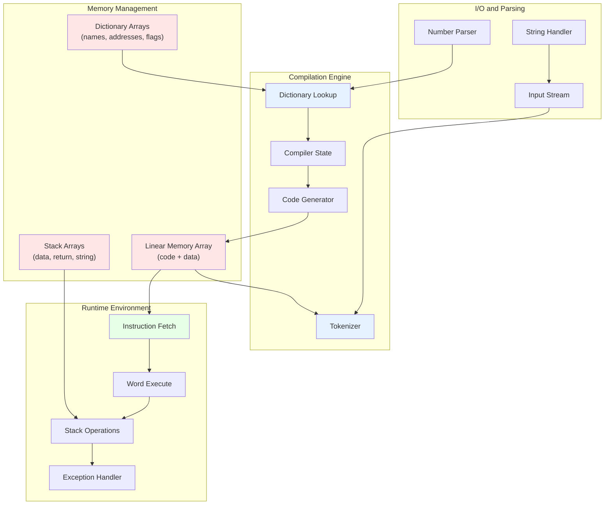
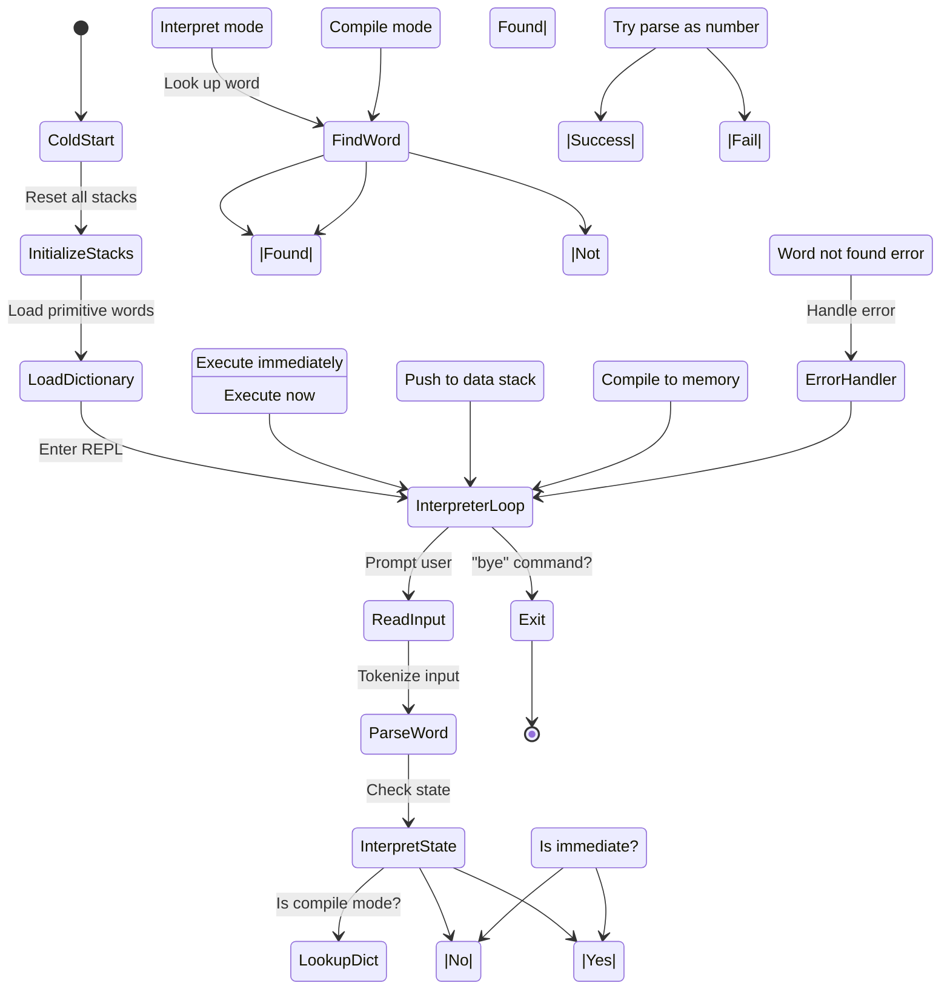

# Bashforth Language-Agnostic Design Specification - Version 2

## Abstract

Complete design specification for a Forth interpreter implementation independent of any programming language. Includes detailed algorithms, pseudocode, concrete examples, and design trade-offs.

## Core Architecture Diagram



## Enhanced Abstract Data Structures

### Unified Memory Model

```
Memory[n] = Cell
  where Cell is one of:
    - SignedInteger: 64-bit signed number
    - Address: Reference to memory location
    - FunctionRef: Reference to code
    - StringRef: Reference to string
    - RawString: Embedded string data
    
Invariant: All cells addressable by index 0..MaxMemory
```

### Stack Abstract Data Type

```
interface Stack<T> {
  void push(T value)
    // Add value to top
    // Throw StackOverflowException if full
    
  T pop()
    // Remove and return top value
    // Throw StackUnderflowException if empty
    
  T peek()
    // Return top without removal
    // Throw StackUnderflowException if empty
    
  int depth()
    // Return number of elements
    
  void clear()
    // Empty the stack
}

// Optimization: TOS Caching
interface OptimizedStack<T> extends Stack<T> {
  T topOfStack  // Cache for top element
  
  push(T value) {
    array[++pointer] = topOfStack
    topOfStack = value
  }
  
  T pop() {
    T result = topOfStack
    topOfStack = array[pointer--]
    return result
  }
}
```

### Complete State Structure

```
interpreter_state = {
  // Physical stacks
  data_stack: Array[Integer, 256],
  return_stack: Array[Integer, 256],
  string_stack: Array[String, 256],
  
  // Stack pointers and cached values
  data_stack_ptr: Integer,
  return_stack_ptr: Integer,
  string_stack_ptr: Integer,
  top_of_stack: Integer,           // Cached
  top_of_string_stack: String,     // Cached
  
  // Memory and Dictionary
  memory: Array[Word, MaxMemory],
  headers: Array[String, MaxWords],
  execution_tokens: Array[Address, MaxWords],
  header_flags: Array[Bits, MaxWords],
  
  // Virtual machine registers
  instruction_pointer: Address,
  word_pointer: Address,
  
  // Dictionary statistics
  word_count: Integer,
  dictionary_pointer: Address,     // HERE
  last_word_address: Address,
  
  // Compilation state
  compile_state: Boolean,          // true=compile, false=interpret
  numeric_base: Integer,           // 2, 8, 10, 16
  
  // Exception handling
  exception_frame_stack: LinkedList<CatchFrame>,
  
  // Configuration
  memory_size: Integer,
  stack_size: Integer,
  pad_distance: Integer
}
```

## Detailed Algorithms

### Algorithm 1: Main Execution Loop

```
Algorithm: EXECUTE_PROGRAM()
  while instruction_pointer < memory_limit:
    // Fetch and execute cycle
    word_address := memory[instruction_pointer]
    instruction_pointer := instruction_pointer + 1
    
    EXECUTE_WORD(word_address)
    
    if exception_occurred:
      HANDLE_EXCEPTION()
    end if
  end while
  
  return interpreter_state

Algorithm: EXECUTE_WORD(address)
  switch (typeof(memory[address])):
    case PRIMITIVE_FUNCTION:
      CALL_NATIVE_FUNCTION(memory[address])
    case HIGH_LEVEL_WORD:
      word_pointer := address
      instruction_pointer := memory[address + 1]
    case INTEGER_LITERAL:
      PUSH_TO_STACK(memory[address])
    default:
      THROW(INVALID_INSTRUCTION)
```

### Algorithm 2: Complete Word Definition

```
Algorithm: DEFINE_WORD(name, body_tokens)
  // Allocate space for new word header
  if word_count >= max_words:
    THROW(DICTIONARY_FULL)
  
  // Create header entry
  headers[word_count] := name
  
  // Save code address
  execution_tokens[word_count] := dictionary_pointer
  
  // Initialize flags (not immediate, not hidden)
  header_flags[word_count] := SMUDGE_BIT
  
  // Compile word prologue for high-level words
  if body_tokens[0] is not NEST:
    memory[dictionary_pointer] := NEST
    dictionary_pointer := dictionary_pointer + 1
  
  // Compile body
  for each token in body_tokens:
    memory[dictionary_pointer] := token
    dictionary_pointer := dictionary_pointer + 1
  
  // Compile word epilogue
  memory[dictionary_pointer] := UNNEST
  dictionary_pointer := dictionary_pointer + 1
  
  // Update dictionary
  word_count := word_count + 1
  
  // Word is now revealed and findable
  return execution_tokens[word_count - 1]
```

### Algorithm 3: Stack Frame Operations

```
Algorithm: CALL_HIGH_LEVEL_WORD(address)
  // Save current execution context
  return_stack_ptr := return_stack_ptr + 1
  return_stack[return_stack_ptr] := instruction_pointer
  
  // Jump to word code
  instruction_pointer := address + 1  // Skip NEST
  
Algorithm: RETURN_FROM_WORD()
  // Restore previous execution context
  instruction_pointer := return_stack[return_stack_ptr]
  return_stack_ptr := return_stack_ptr - 1
  
  if instruction_pointer < 0:
    END_PROGRAM()
```

### Algorithm 4: Comprehensive Loop Handling

```
Algorithm: START_LOOP(limit, start)
  // Push loop parameters to return stack
  return_stack_ptr := return_stack_ptr + 1
  return_stack[return_stack_ptr] := start      // Loop counter
  
  return_stack_ptr := return_stack_ptr + 1
  return_stack[return_stack_ptr] := limit      // Loop limit
  
  // Advance over branch offset
  instruction_pointer := instruction_pointer + 1

Algorithm: ITERATE_LOOP()
  // Get loop parameters
  counter_addr := return_stack_ptr
  limit_addr := return_stack_ptr - 1
  
  counter := return_stack[counter_addr]
  limit := return_stack[limit_addr]
  
  // Increment counter
  counter := counter + 1
  return_stack[counter_addr] := counter
  
  // Check loop condition
  offset := memory[instruction_pointer]
  
  if counter < limit:
    // Continue loop
    instruction_pointer := instruction_pointer + offset
  else:
    // Exit loop
    instruction_pointer := instruction_pointer + 1
    return_stack_ptr := return_stack_ptr - 2

Algorithm: LOOP_INDEX()
  // Get current loop counter
  return return_stack[return_stack_ptr]
```

### Algorithm 5: String Processing

```
Algorithm: PACK_MEMORY_TO_STRING(address, length) -> String
  result_string := ""
  
  for index from 0 to length - 1:
    byte_value := memory[address + index] & 0xFF
    result_string := result_string + chr(byte_value)
  end for
  
  return result_string

Algorithm: UNPACK_STRING_TO_MEMORY(string, address)
  length := strlen(string)
  
  for index from 0 to length - 1:
    byte_value := ord(string[index])
    memory[address + index] := byte_value & 0xFF
  end for
  
  return length
```

### Algorithm 6: Exception Handling

```
Algorithm: THROW_EXCEPTION(error_code)
  if error_code == 0:
    // No exception
    return
  
  if exception_frame_stack.isEmpty():
    // Top-level exception
    PRINT_ERROR_MESSAGE(error_code)
    RESET_INTERPRETER()
    return
  
  // Pop catch frame
  frame := exception_frame_stack.pop()
  
  // Restore state from frame
  instruction_pointer := frame.saved_ip
  data_stack_ptr := frame.saved_sp
  exception_frame_stack := frame.parent_frame
  
  // Put error code on stack
  PUSH_TO_STACK(error_code)

Algorithm: CATCH_EXCEPTION(word_address) -> Result
  // Create new exception frame
  frame := {
    saved_ip: instruction_pointer,
    saved_sp: data_stack_ptr,
    parent_frame: exception_frame_stack,
    handler_address: current_handler
  }
  
  exception_frame_stack.push(frame)
  
  // Execute protected word
  EXECUTE_WORD(word_address)
  
  // If we get here, no exception occurred
  exception_frame_stack.pop()
  PUSH_TO_STACK(0)  // Success indicator
```

### Algorithm 7: Dictionary Lookup with Performance

```
Algorithm: FIND_WORD_OPTIMIZED(name) -> Integer | NOTFOUND
  // Search from most recent to oldest (most likely case first)
  for index from (word_count - 1) down to 0:
    // Skip hidden words (smudge bit not set)
    if (header_flags[index] & SMUDGE_BIT) == 0:
      continue
    
    if headers[index] == name:
      return index
    
    // Optional: Cache recently found words
  end for
  
  return NOT_FOUND

Algorithm: GET_EXECUTION_TOKEN(word_number) -> Address
  if word_number < 0 or word_number >= word_count:
    THROW(INVALID_WORD_NUMBER)
  
  return execution_tokens[word_number]
```

### Algorithm 8: Literal Compilation

```
Algorithm: COMPILE_LITERAL(value)
  // Emit LIT instruction
  memory[dictionary_pointer] := LIT_INSTRUCTION
  dictionary_pointer := dictionary_pointer + 1
  
  // Emit literal value
  memory[dictionary_pointer] := value
  dictionary_pointer := dictionary_pointer + 1

Algorithm: EXECUTE_LIT()
  // Load literal from memory
  literal_value := memory[instruction_pointer]
  instruction_pointer := instruction_pointer + 1
  
  // Push to stack
  PUSH_TO_STACK(literal_value)
```

## Control Flow Graph Examples

### IF...THEN...ELSE Structure

```
Source:
  condition if
    true_branch
  else
    false_branch
  then

Compilation:
  condition
  BRANCH_IF_ZERO (offset to ELSE)
  true_branch
  BRANCH (offset to THEN)
ELSE:
  false_branch
THEN:
  (continue)
```

### DO...LOOP Structure

```
Source:
  limit start do
    body
    i
  loop

Compilation:
  limit start
  DO (saves loop parameters)
  body
  LOOP (branches back to body if i < limit)
  (continue)
```

## State Transition Flowchart



## Memory Allocation Strategy

```
Algorithm: ALLOCATE_MEMORY(cells_needed)
  if dictionary_pointer + cells_needed > memory_limit:
    THROW(DICTIONARY_OVERFLOW)
  
  allocated_address := dictionary_pointer
  dictionary_pointer := dictionary_pointer + cells_needed
  
  return allocated_address

Algorithm: RECLAIM_MEMORY_BOUNDARY(boundary_address)
  // Forget all words after boundary
  for index from (word_count - 1) down to 0:
    if execution_tokens[index] < boundary_address:
      break
    
    word_count := word_count - 1
  end for
  
  dictionary_pointer := boundary_address
```

## Implementation Trade-offs

```
CHOICE: Dense vs. Sparse Memory
  Dense:  Contiguous array
    Pro:  Cache efficient, smaller memory
    Con:  Must pre-allocate
  Sparse: Associative array (hash map)
    Pro:  Dynamic growth, no pre-allocation
    Con:  Slower access, more memory per cell
  Choice: Sparse (for flexibility)

CHOICE: Linear vs. Threaded Dictionary
  Linear:   Array of names/addresses
    Pro:  Fast iteration, simple
    Con:  Can't efficiently remove words
  Threaded: Linked list of headers
    Pro:  Efficient word removal
    Con:  Slower search, more pointers
  Choice: Linear (simpler, adequate for bash)

CHOICE: Stack Array Size
  Small (256):  Limits recursion depth
    Pro:  Saves memory
    Con:  Limits program complexity
  Large (1024+): More recursion
    Pro:  Fewer overflow errors
    Con:  More memory usage
  Choice: Configurable (default 256)

CHOICE: Caching Top of Stack
  Cached:   One value in fast register
    Pro:  50% performance improvement
    Con:  Must synchronize on overflow
  Uncached: Everything in array
    Pro:  Simpler logic
    Con:  Slower
  Choice: Cached (performance critical)
```

## Pseudocode Examples

### Complete CALL/RETURN Cycle

```
// Executing: : double 2 * ;  then  5 double

// Definition phase:
DEFINE_WORD("double", [LIT, 2, MUL, UNNEST])
// m[] = [LIT, 2, MUL, UNNEST, ...]
// word_count points to "double"

// Execution phase: 5 double
PUSH_TO_STACK(5)                    // Stack: [5]
FIND_WORD("double")                 // Returns address
CALL_HIGH_LEVEL_WORD(address)       // Save IP, jump
// Now IP points into "double"

// Execute LIT
value := memory[IP++]               // value = 2
PUSH_TO_STACK(value)                // Stack: [5, 2]

// Execute MUL
TOS := memory[IP++]                 // TOS = MUL
a := POP_STACK()                    // a = 2
b := PEEK_STACK()                   // b = 5
result := a * b                      // result = 10
REPLACE_TOS(result)                 // Stack: [10]

// Execute UNNEST (return)
IP := return_stack[return_stack_ptr--]  // Restore IP
// Back in interpreter loop
```

## Summary of v2 Improvements

- Complete architecture diagram with subsystems
- Enhanced abstract data structures with interfaces
- 8 detailed algorithms with pseudocode
- Comprehensive state structure definition
- Memory allocation strategy discussion
- Implementation trade-offs documented
- Multiple flowchart examples
- Concrete execution traces
- Performance considerations
- Language implementation guide
